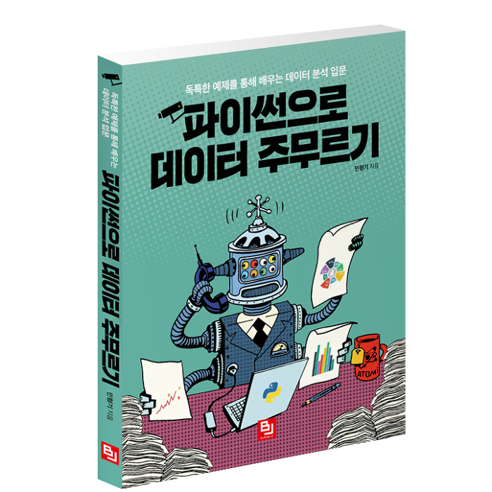

# 파이썬으로 데이터 주무르기

</img>

### 2020.02.28 시작

- ##### 2020.02.28 : [1장. 서울시 구별 CCTV 현황](https://github.com/samuel950523/PythonDataBook/tree/master/1.Seoul_CCTV)
  + ##### 2020.03.13 : pandas 기초
  + ##### 2020.03.13 : matplotlib 기초
- ##### 2020.02.29 ~ 2020.03.01 : [2장. 서울시 범죄 현황 분석](https://github.com/samuel950523/PythonDataBook/tree/master/2.Seoul_Crime)
- ##### 2020.02.29 : [3장. 시카고 샌드위치 맛집 분석](https://github.com/samuel950523/PythonDataBook/tree/master/3.Chicago_Sandwich)
- ##### 2020.03.01 ~ 2020.03.05 : [4장. 셀프 주유소는 정말 저렴할까](https://github.com/samuel950523/PythonDataBook/tree/master/4.Self_Oil_Station)
- ##### 2020.03.06 ~ 2020.03.07 : [5장. 우리나라 인구 소멸 위기 지역 분석](https://github.com/samuel950523/PythonDataBook/tree/master/5.Korean_Population_Warning)
- ##### 2020.03.08 ~ 2020.03.10 : [6장. 19대 대선 결과 분석](https://github.com/samuel950523/PythonDataBook/tree/master/6.19th_Election_Result)
- ##### 2020.03.13 : [7장. 시계열 데이터 다루기](https://github.com/samuel950523/PythonDataBook/tree/master/7.Time_Series_Data_Handle)
- ##### 2020.03.13 : [8장. 자연어 처리](https://github.com/samuel950523/PythonDataBook/tree/master/8.Natural_Language_Processing)
